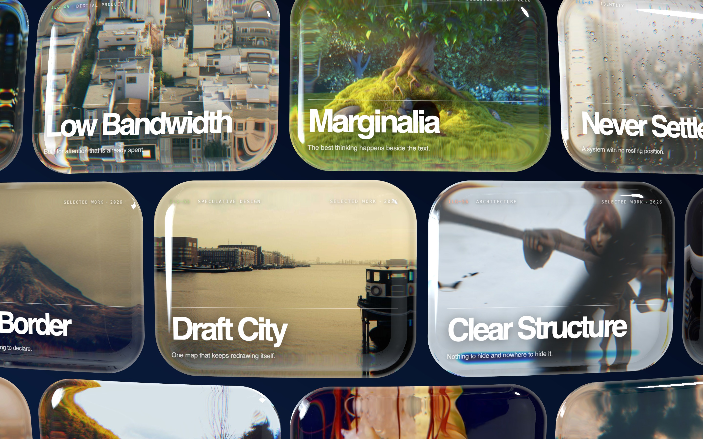

# Infinite Liquid Glass



An infinite, draggable, brick-staggered grid of rounded-rectangle glass tiles wrapped onto a very large sphere, each tile a thick refractive lens over its own video or photo. WebGPU via three.js TSL.

Live demo: [infiniteglass.codyh.xyz](https://infiniteglass.codyh.xyz)

Inspired by: [infinite-liquid-glass.shader.se](https://infinite-liquid-glass.shader.se/?v=2)

## Run

```bash
npm install
npm run media     # optional: downloads photos, clips, HDRI
npm run dev       # http://127.0.0.1:5178
```

- Without `npm run media` the app falls back to procedural canvas textures and a procedural environment. Zero assets required.

## Controls

- Drag to scroll. The grid wraps modularly, so scroll is unbounded.
- Fling to dolly the camera back. There is no zoom input — the camera pulls back in proportion to drag speed.
- Hover a tile to lift it; hover near its edge to tilt that edge. One tile responds at a time.
- Wheel / two-finger scroll feeds the same scroll targets as a drag.

## Structure

| file | role |
|---|---|
| `src/config.js` | every tunable |
| `src/layout.js` | sphere-grid solver, modular wrap, media assignment, cover fit |
| `src/glass.js` | TSL material — SDF, bevel, normal, dispersion, Fresnel, rim |
| `src/media.js` | video/photo/HDRI loading with procedural fallbacks |
| `src/input.js` | springs, drag inertia, pointer tracking, speed-driven dolly |
| `src/overlay.js` | matrix3d-synced DOM text over the WebGPU canvas |
| `src/main.js` | scene assembly, tile placement, culling, frame loop |

## How it works

- **Bevel.** Thickness is `pow(1 - pow(t, n), 1/n) * thickness` with `n = 3.9` — a Lamé curve, flat plateau and fast rounded shoulder.
- **Bevel width exceeds corner radius** (0.192 vs 0.163 of plane width), so the refractive band reads as a meniscus wrapping the tile.
- **One sphere.** Each tile's local vertex sag uses the same `sphereRadius` as the global layout, so all tiles join into a continuous shell. Peripheral tiles tilt away from camera and lens hard; centre tiles stay near-undistorted.
- **5-tap dispersion**, triangular RGB response, per-channel IOR 2.14–2.46 from base `ior: 2.3`.
- **Reflection capped** at `envMaxMix: 0.27` so the glass stays transmissive.
- `bevelMaxSlope: 1.74` clamps the rim normal; uncapped, total internal reflection paints a black ring.
- `clamp(uv, 0, 1)` happens before the cover transform, which is what streaks refraction along tile edges.

## Motion model

```
pan     -> scrollTarget += 1.5 * delta
panEnd  -> scrollTarget += 0.1 * velocity
scrollX/Y = spring(scrollTarget, {100, 16, 0.5})
speed     = hypot(scrollX.velocity, scrollY.velocity)
dolly     = spring(speed, {140, 24, 0.6})
camera.z += 3·maxZoomZ · tanh(0.04 · dolly / (3·maxZoomZ))
```

- `speed` tracks the springs' velocities, not the pointer's, so it decays to zero as the grid settles.

## Pointer tilt

```
u, v    = (cursor - tileCentre) / tileHalfExtent      # in half-tiles
d       = max(|u|, |v|)
hovered = argmin(d) over all tiles, if d <= 1
rx, ry  = -maxAngle * clamp(v, -1, 1), -maxAngle * clamp(u, -1, 1)
```

- Normalised per tile, so a squashed peripheral tile responds like a face-on central one.
- Zero at the centre, peak at the edges.
- One tile at a time. Transitions are smoothed in time by the springs, not in space by a falloff.
- Argmin rather than a hit test: projected tile boxes overlap slightly at the periphery. Resolved once per frame, consumed the next.
- Off-screen tiles snap their tilt springs to target — they wrap by a whole grid period while culled.
- Knobs in `config.js`: `TILT.maxAngle`, `TILT.lift`, `TILT.direction` (`-1` makes the near edge dip). `CAMERA.parallax` is `0`; set it to `0.05` to instead tilt the whole scene, as the original does.

## Grid maths

- Column and row counts are solved, not divided. A point at arc length `s` sits at lateral offset `R·sin(s/R)`, depth `R·(1-cos(s/R))`.
- The solver bisects (24 steps) for the arc whose card edge covers the viewport plus zoom headroom, then rounds to an even count — the brick stagger only tiles seamlessly with even columns.

```
x = wrap((col - (cols-1)/2)·cellW + scrollX + (row%2)·cellW/2, cols·cellW)
y = wrap(-(row - (rows-1)/2)·cellH - scrollY, rows·cellH)
```

## Performance tiering

Device is `low` if `pointer: coarse` **or** `hardwareConcurrency ≤ 6` **or** `deviceMemory ≤ 4`.

| | low | high |
|---|---|---|
| DPR clamp | `[1, 1.5]` | `[1, 2]` |
| dispersion taps | 3 | 5 |
| concurrent videos | 8 | all |

## Verification

Harnesses launch a throwaway Chrome, drive it over CDP, and always kill it on exit.

```bash
npm run verify              # render + console/exception capture + screenshot
npm run verify:drag         # pointer drag; asserts the grid scrolls, wraps, and dollies
npm run verify:tilt         # asserts per-tile tilt, one tile at a time, no camera orbit
npm run probe '<js expr>'   # evaluate an expression in the live page
npm run hero                # regenerate docs/hero.jpg
```

- Shared CDP plumbing lives in `scripts/lib/cdp.mjs`.
- Headless by default — a visible window lets the physical cursor race the synthetic one. `HEADFUL=1` to watch.
- Chrome is found automatically on macOS and Linux; `CHROME_PATH` overrides. `ILG_URL` points the harnesses at a different origin.
- `window.__ilg` exposes `{controls, camera, materials, items, layout, meshes, tilts, hovered}`.

## Media

- Tile copy is placeholder content written for this repo. Swap it in `src/overlay.js`.
- Default content is local mp4s and photos, so the demo is self-contained.
- HLS is supported: put an `.m3u8` URL in `public/media/manifest.json` and it plays via hls.js, or natively where the browser supports it. `?forcehls` forces the MSE path.
- `public/media/` is gitignored. Run `npm run media` to populate it.
- Deploys fetch it at build time via the `vercel-build` script. Every download is optional and cached, so a failed fetch degrades to procedural textures rather than failing the build.

## Credits

- Effect design: [Shader Development Studio](https://shader.se)
- HDRI: `studio_small_03` from [Poly Haven](https://polyhaven.com) (CC0)
- Photos: [Lorem Picsum](https://picsum.photos)
- Clips: test-videos.co.uk (Blender Foundation open movies)

## License

MIT — see [LICENSE](LICENSE).
